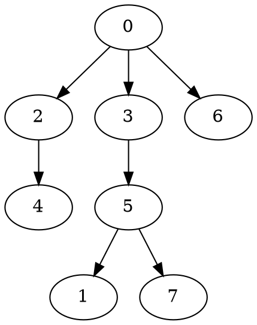

# Tutorial

We'll be walking through a short example that builds a random graph, run Dijkstra's single-source shortest path algorithm, and outputs the results.

To start, we need to include the graph data structure we'll be using, an `Out_adjacency_list`.  And everything in this library resides in the `graph` namespace, so for brevity we'll just pull that into the global namespace.

```cpp
#include <graph/Out_adjacency_list.hpp>
using namespace graph;
```

Now, in our `main` function, we create a new `Out_adjacency_list`, the default constructor of which makes a graph with no vertices or edges.

```cpp
int main() {
	Out_adjacency_list g;
```

Now we can add a few vertices to the graph simply by calling the `insert_vert()` method which also returns the added vertex even though we're not using it here.

```cpp
	for (int i = 0; i < 8; ++i)
		g.insert_vert();
```

To make our graph useful, it needs some edges.  So let's add edges using the `insert_edge()` method between random pairs of vertices sampled using the `random_vert()` method.

```cpp
	std::mt19937_64 random;
	for (int i = 0; i < 32; ++i) {
		auto u = g.random_vert(random), v = g.random_vert(random);
		g.insert_edge(u, v);
	}
```

Dijkstra's algorithm supports edge weights, so let's assign random weights to each edge.  Any function from edges to weights will work, and edges are always valid keys for `std::map` or `std::unordered_map`.  However, every graph knows how to make an efficient map from its edges to another type.  In the case of `Stable_adjacency_list`, this is effectively an `std::vector`.  We construct a new map using the `edge_map()` method.

```cpp
	auto weight = g.edge_map<double>();
```

And assign random weights to each edge using `operator[]` provided by the map.

```
	for (auto e : g.edges())
		weight[e] = std::uniform_real_distribution(1.0, 2.0)(random);
```
Running Dijkstra's algorithm is now as simple as calling the `shortest_paths_from()` method, which returns a tree of shortest paths and a map from vertices to distances from the source.

```
	auto [tree, distance] = g.shortest_paths_from(g.random_vert(random), weight);
```

To round out our `main` function, we'll output the tree of shortest paths (which itself satisfies the `Graph` concept) in [DOT format](https://en.wikipedia.org/wiki/DOT_(graph_description_language)).  This format supports attributes on vertices and edges, so we can also include our distance map in the output.

```cpp
	using namespace graph::attributes; // for `_of_vert`
	std::cout << tree.dot_format("distance"_of_vert = distance) << std::endl;
}
```

Compiling and running this program outputs:


Now that you understand the basic usage, I recommend you head on over to the [documentation overview](Overview.md).
